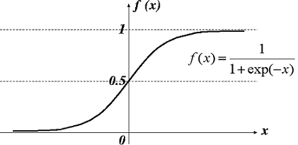
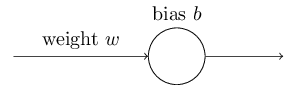
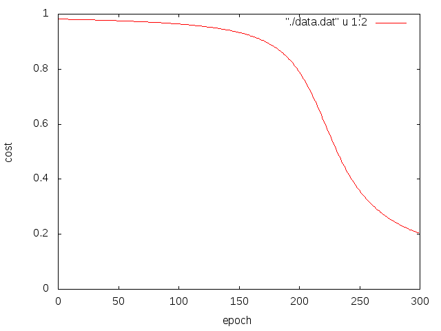
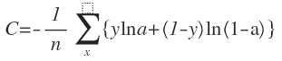
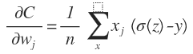
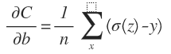
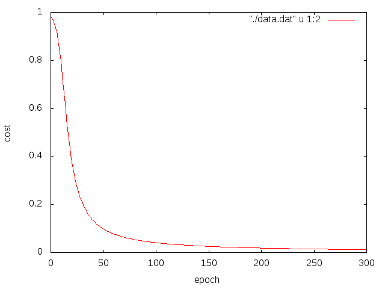

# クロスエントロピーコスト関数
シグモイドニューロンの動きを通してクロスエントロピーコスト関数がなんぞやかをみていく．

## シグモイドニューロン
### 目的
ニューロンがどのように学習するのかを単純なシグモイドニューロンを用いて確認する．

### 原理
シグモイド関数  

ニューロン  

入力１に対して出力０を返す．

重みとバイアスによって計算した値をシグモイド関数に通して出力とする．

### 条件
test01: 初期の重みを0.6，バイアスを0.9，学習係数を0.15とする．

test02: 初期の重みを2.0，バイアスを2.0，学習係数を0.15とする．

### 結果
test01

test02

### 考察
初期の重みやバイアスが大きい場合，学習速度が遅くなった．ここで，ニューロンが重みとバイアスのコスト関数の偏微分によって決まる値で更新されるとすると，「学習が遅い」ということは，その偏微分が小さいということと同じことである．具体的にはコスト関数を二次導関数を用いたことにより偏微分が小さくなっている．シグモイド関数は値が1に近づくと傾き（偏微分）が小さくなることから説明できる．

※数式による説明は省略します．

## クロスエントロピーコスト関数の導入
学習の遅さを解決するためにクロスエントロピーを導入する．

### 原理
クロスエントロピーを次式で定義する．

すると各偏微分は

，

となり，偏微分の項が消えて学習速度低下を防ぐことが出来るようになくなっている．

### 条件
test03: 初期の重みを0.6，バイアスを0.9，学習係数を0.15とする．

test04: 初期の重みを2.0，バイアスを2.0，学習係数を0.15とする．

### 結果
test03

test04

クロスエントロピーを導入することで，重みやバイアスが大きい場合でも早く学習できることを確認した．
