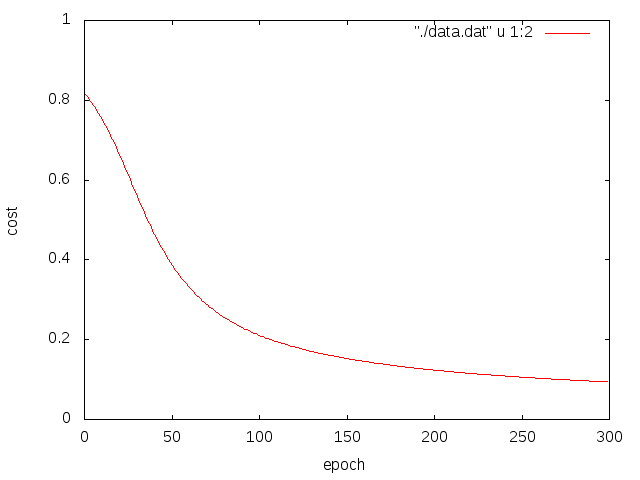

# クロスエントロピーコスト関数
シグモイドニューロンの動きを通してクロスエントロピーコスト関数がなんぞやかをみていく．

## シグモイドニューロン
### 目的
ニューロンがどのように学習するのかを単純なシグモイドニューロンを用いて確認する．

### 原理

入力１に対して出力０を返す．

### 条件
test01: 初期の重みを0.6，バイアスを0.9，学習係数を0.15とする．

test02: 初期の重みを2.0，バイアスを2.0，学習係数を0.15とする．

### 結果
test01

test02

